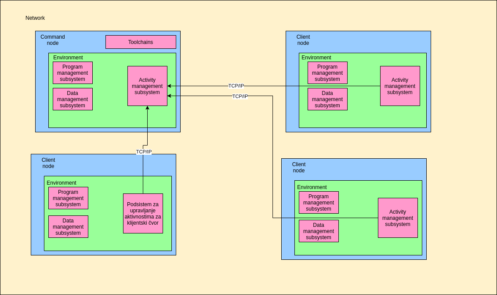

# CoNAL

## Introduction

With the development of computer systems, it is desirable to achieve their basic purpose: the transformation of data as input into data that are the results of a calculation. The whole process of transformation is called an algorithm, and it is performed by a computer according to the given instructions, which we call a program. When the volume of data became larger and due to the fact that it was not possible to create a processor unit that would process the given data fast enough as in previous generations, the emergence of multiprocessor systems occurred. This is a consequence of Moore's Law. Problems of parallel execution and how to ensure the preservation of data consistency have started to appear in the systems of multiprocessor units. As the goal was to keep all the processor units on one computer system, the problem of heating and too little space for the flexibility of adding new processor units began to appear. With the advent of computer networks, computers began to connect to different topologies and began to share data. Today's computing is based mainly on distributed systems where multiple networked computers exchange data and perform calculations in parallel to get results. The most obvious examples are simulations of physical systems in research laboratories such as CERN. With the cheapening and availability of mini-computers such as the Raspberry PI, the cost of adding new computer units (nodes) has become cheaper. Many papers were based on the organization and topology of the system in networks when embedded computers were included in the system. The problem that arises here are significant differences in processor architectures, so programs from one computer cannot be easily transferred to another and then executed directly. The same is true for data in most cases as a result of the fact that different processor architectures represent complex data differently.

CoNAL deals with the implementation of a system that allows the developer to easily distribute data and programs to different computer units regardless of their processor architecture.

## Setup

	mkdir build
	cd build
	cmake ../conal/ -DCMAKE_INSTALL_PREFIX=/opt/conal/
	make
	make install

## Running environment

	. /opt/conal/setup-env.sh /opt/conal/

## Using Docker image 

to run CoNAL master instance:
	
	docker run --rm -it --name conal_instance_master fantastic001/conal 
	
To run CoNAL in slave mode:

	docker run -it --rm --name conal_instance_client \
		-e CONAL_MASTER_HOSTNAME=masterHostname \
		-e CONAL_CLIENT_NAME=myClient \
		fantastic001/conal 

To run CoNAL with custom installation directory, just mount your installation to /opt/conal inside container:

	docker run -it --rm --name conal_instance_master -v conal/location/path:/opt/conal fantastic001/conal 

## Starting tasks

Tasks are started using `start_task` command in CoNAL prompt. For instance, to execute test task on all clients, in master node run:

	start_task "*" TEST param1 param2 

On client side, you should see message "Hello World". 

If you want to implement your own task code, you can start with this example:

```cpp
#include <vector>
#include <iostream>
#include <conal_utilities.hpp>

using namespace std; 
using namespace conal::code_manager;
using namespace conal::utilities;

int start(params& in, params& out) {
	cout << "Hello from loaded program\n";
	// check if there is some input data
	if (in.size() > 0) {
		wait_for_data(in[0]);
		cout << "Value changed\n";
	}
	return 0; 
}
```

To start task on all clients:

	start_task "*" mycode.cpp

or, for instance, to start task only on client with ip 192.168.0.100:

	start_task "name=192.168.0.100" mycode.cpp

Now, you can see that our task code requires some data to work with, you can define data in various ways:

* having shared variable across all clients (value will be same in the beginning)
* have dummy variable

For creating simple variables you can simply type:

	variable myVarName myvalue

and variable will be created on all clients. 

# Listing all connected clients on master node

To list all clients, on master node run:

	request activity_manager list "*"

Here "*" means "all clients". This parameter can be some other filter, please refer to architecture document for more details. 

# Architecture 

## Supported platforms 

As the system is required to be compatible with the POSIX specification, the tools and the operating system interfaces with which CoNAL communicates must be POSIX compatible. On the command node, to whose command line the user has access, the interaction with the system is enabled through the command interpreter "Bash". The interaction begins with the user loading a Bash script into the interpreter itself that initializes the components and prepares only the environment for the interaction. When loading a script, a process consisting of the following steps occurs:

1. Initialization of all variables necessary for the functioning of the components
2. Preparation for component startup
3. Detection of the features of the operating system and hardware on which the system runs
4. Start the components that are defined to run during system initialization
5. Providing a command line to a user who is now ready to accept commands to components.

It should be noted here that the components run in parallel in the background during initialization and that they remain running throughout the life of the system. Using the command line, the user sends messages to the components and thus requests the functionality and information of the components.

## Graphical diagrams 

Figure 1 shows the organization and topology of the system and its components as well as the connection to other nodes. The figure shows that all client nodes communicate with one command node via a TCP / IP connection. This communication is performed by only one subsystem. Subsystems communicate internally by another mechanism and other subsystems are not visible to external nodes. It should also be noted here that all nodes are located on the same computer network.



## Environment
The environment is the first instance that the user runs. The environment consists of a Bash script that is taught to the Bash interpreter using the Bash command "source". The script is responsible for setting environment variables such as `PATH` and `LD_LIBRARY_PATH` which allow the user to interact with the system through dedicated tools to communicate with components. In addition to this, the environment also offers a software library that allows components a unique way to communicate via POSIX FIFO files. The environment then reads the user configuration and runs the components depending on the configuration by the user. In addition to all this, the environment also detects the processor architecture and, in the case of a client node, finds a command node in the network. The parameters detected at this stage serve the activity management subsystem to send data to the command node.

## Program management subsystem - Code Manager

In the case of a command node, the program management subsystem has the task of running a compiler for certain architectures, serializing the translated code and preparing for sending as well as communicating with the activity management subsystem which then sends the program code to client nodes.

In the case of a client node, the program management subsystem has the task of deserializing the code received by the command node, placing the binary executable file on the file system, and running the program.

## Data management subsystem
The data management subsystem has the task of creating data on a node of different types such as arrays, trivial variables, ranges, etc. This component has the task of parsing the data specification specified by the user as well as dividing the data into smaller parts which are later passed to the activity management subsystem and then sent to the client nodes.

In the case of complex data structures such as, for example, arrays, this subsystem indexes and retrieves elements from the data structure.

In addition to all the above activities, the data management subsystem informs the program management subsystem about newly created variables and data changes. In this way, when a user or a program changes a data, other programs are notified of that change.


## Activity Management Subsystem

In the case of a command node, the activity management subsystem is responsible for detecting and managing client nodes, communicating with other subsystems to run programs on client nodes, enabling other subsystems to access client nodes, and sending commands to client nodes.

In the case of client nodes, the activity management subsystem connects to the master command node whose network address is read from the user-specified configuration, which is passed to the subsystem during environment initialization. On the client side, the activity management subsystem accepts serialized program executable code from the command node and forwards such code to the program management subsystem. Similarly, when creating variables on a command node, this subsystem accepts commands to pass to the data management subsystem to create data on the client node.

Communication with nodes is performed by a specific protocol that relies on the TCP / IP network system. The reason for choosing this method of communication is the simplicity and speed provided by direct communication using TCP / IP network system (unlike the use of higher levels in the OSI model and higher level protocols such as HTTP), while allowing all sent messages to reach their destination in the given order, which is extremely important with this type of system.


# Demo

For the purposes of the demonstration, three docker containers were launched:

1. Command node: `docker run --rm -it --name conal_instance_master -v (pwd)/opt:/opt/conal/ fantastic001/conal:1.0`
2. First client node: `docker run --rm -it --name conal_instance_slave1 -e CONAL_MASTER_HOSTNAME=172.17.0.2 -e CONAL_CLIENT_NAME=slave1 fantastic001/conal:1.0`
3. Second client node: `docker run --rm -it --name conal_instance_slave2 -e CONAL_MASTER_HOSTNAME=172.17.0.2 -e CONAL_CLIENT_NAME=slave2 fantastic001/conal:1.0`

A variable that stores the sum has been created on all client nodes: `variable sum 0`

Creating each variable will cause automatic client splitting. In case of demonstration, a array of 4 elements was created: 
```sh
create_data A % “Array(1,2,3,4)”
```

After creating the array, it is possible to check that all variables are well created on all clients: 

```sh
client_request % data_manager list 
```

which gives the following output:

```
172.17.0.4 |> A sum
172.17.0.3 |> A sum
```


Then the following source file is created which is a description of the program that finds the variables `A` and sum and calculates the sum of the array and stores it in the `sum` variable:

```cpp

#include <vector>
#include <iostream>
#include <conal_utilities.hpp>
#include <sstream>

using namespace std;
using namespace conal::code_manager;
using namespace conal::utilities;

int start(params& in, params& out) {
   int suma = 0;
   for (auto& q : in) {
       if (q.getIdentifier() == "niz") {
           while (!q.end()) {
               // sve promenljive se cuvaju kao stringovi pa ih je potrebno pretvoriti u broj
               stringstream ss(q.get());
               int element;
               ss >> element;
               suma += element;
           }
       }
   }

   stringstream intToStringconverter;
   intToStringconverter << suma;
   for (auto& p : in) {
       if (p.getIdentifier() == "sum") {
           p.add(intToStringconverter.str()) ;
       }
   }
   return 0;
}

```

To compile this code and run it on all nodes:

```sh
start_task % test.cpp
```

and finally to show value of `sum` variable on all nodes:

```sh
client_request % data_manager get sum
```

Now that we have local sums, we can aggregate them on the master node:

```sh
client_request % data_manager get sum | awk '{s+=$3} END {print s}'
```

